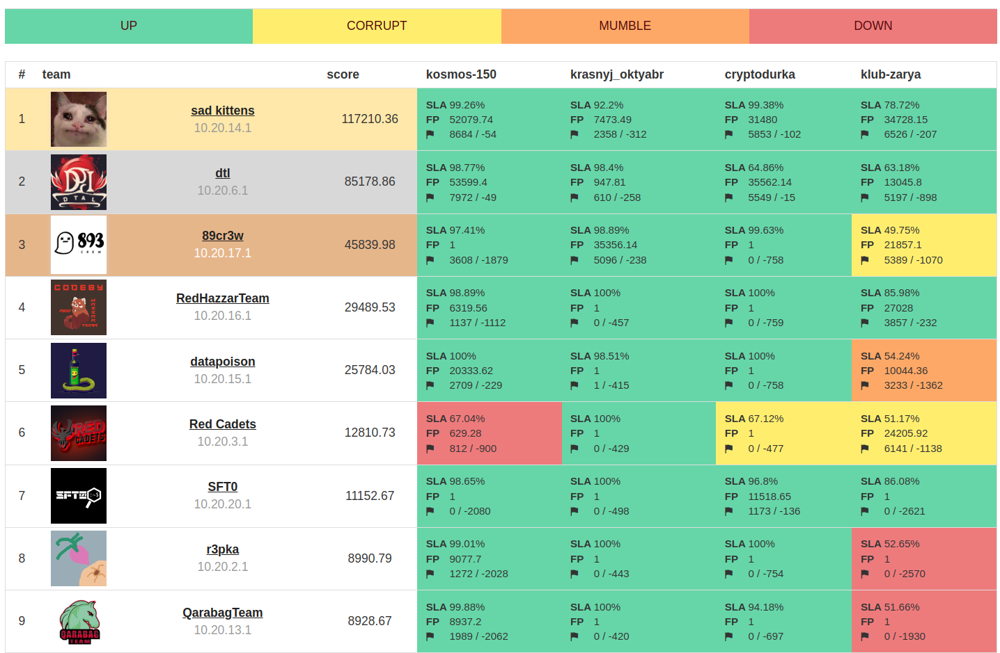

# underground_29_10
Repository contains source code of services, checkers and sploits.

## Results

## Services

| Service | Language | Checker | Sploits | Authors |
|---------|----------|---------|---------|---------|
| **[kosmos-150](services/kosmos-150/)** | Rust | [Checker](checkers/kosmos-150/) | [Sploits](sploits/kosmos-150/) | [@enmex](https://github.com/enmex) |
| **[klub-zarya](services/klub-zarya/)** | Go | [Checker](checkers/klub-zarya/) | [Sploits](sploits/klub-zarya/) | [@enmex](https://github.com/enmex) |
| **[cryptodurka](services/cryptodurka/)** | Python | [Checker](checkers/cryptodurka/) | [Sploits](sploits/cryptodurka/) | [@gusyaross](https://github.com/gusyaross) |
| **[krasnyj_oktyabr](services/krasnyj_oktyabr/)** | C | [Checker](checkers/krasnyj_oktyabr/) | [Sploits](sploits/krasnyj_oktyabr/) | [@lucky624](https://github.com/lucky624) |

## Infrastructure

- DevOps: [@lucky624](https://github.com/lucky624)
- Checksystem: [RuCTF-checksystem](https://github.com/HackerDom/checksystem)

